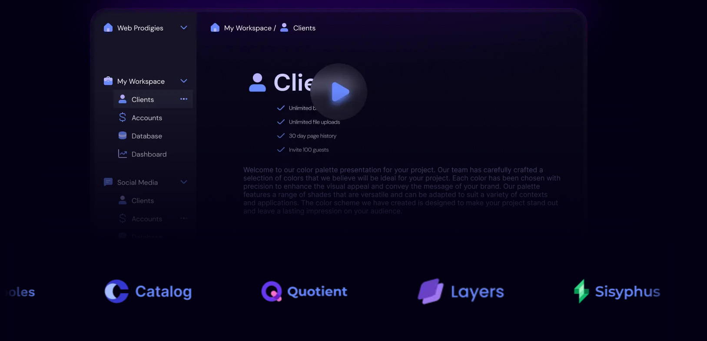

# 🛠️ Collaborative Workspace Tool

A modern and intuitive collaboration platform designed to empower teams and individuals to work together seamlessly in **real-time**. This tool offers private and shared workspaces, file and folder management, and real-time editing features to streamline productivity.

---

### Core Features
- **Private and Shared Workspaces**: Organize your work privately or collaborate with your team in shared spaces.
- **Folders and Files Management**: Easily manage and organize your data with hierarchical folders and files.
- **Real-Time Collaboration**: Work together with your team, seeing changes reflected instantly.

### Subscription Plans
- **Free Plan**:
  - Access to private and shared workspaces.
  - Limited features for basic collaboration.
- **Pro Plan** (Paid):
  - Advanced collaboration features.
  - Access to exclusive productivity tools and enhanced performance.
  - **Secure Payment Integration with Stripe**: Hassle-free, secure, and reliable payment processing for Pro plan subscriptions.

---



## Technologies Used

- Next.js, TypeScript, Supabase, Sockets, Tailwind CSS, shadcn UI, Drizzle ORM, Stripe 

 
### Run it locally

1. Clone the repository:
   ```bash
   git clone https://github.com/Eniimz/cypress-a-collaboration-tool.git
   cd cypress-a-collaboration-tool
   ### Installation

2. Install dependencies:
   ```bash
   npm install
3. A .env file
  ```bash
  NEXT_PUBLIC_SUPABASE_URL=your_supabase_url
  NEXT_PUBLIC_SUPABASE_ANON_KEY=your_supabase_key
  STRIPE_SECRET_KEY=your_stripe_secret_key
  NEXT_PUBLIC_STRIPE_PUBLISHABLE_KEY=your_stripe_publishable_key
  ```
4. ```bash
   npm run dev
   ```
